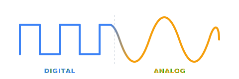
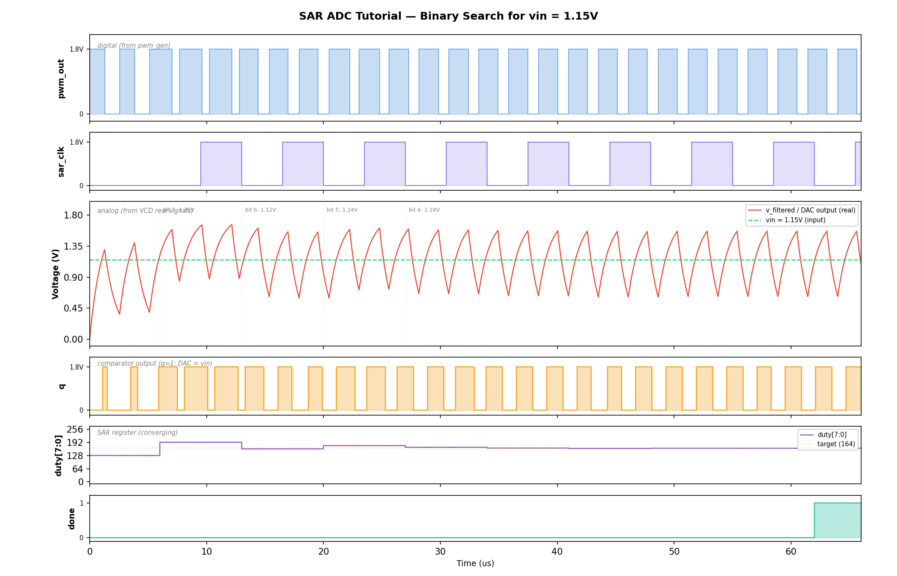

<p align="center">
  
</p>

<h1 align="center">cocotbext-ams</h1>

<p align="center">
  <strong>An ngspice bridge for <a href="https://github.com/cocotb/cocotb">cocotb</a> — open-source mixed-signal co-simulation</strong>
</p>

<p align="center">
  <a href="https://pypi.org/project/cocotbext-ams/"></a>
  <a href="https://github.com/VLSIDA/cocotbext-ams/actions/workflows/test.yml"></a>
  <a href="https://pypi.org/project/cocotbext-ams/"></a>
  <a href="LICENSE"></a>
  <a href="https://vlsida.github.io/cocotbext-ams/"></a>
</p>

---

## Table of Contents

- [Overview](#overview)
- [Prerequisites](#prerequisites)
- [Installation](#installation)
- [Quick Start](#quick-start)
- [Tutorial: PWM DAC with SAR Controller](docs/tutorial/index.md)
- [API Reference](#api-reference)
- [Examples](#examples)
- [Architecture Details](#architecture-details)

## Overview

cocotbext-ams synchronizes cocotb's digital simulation with ngspice's analog
simulation via the libngspice shared library API. This allows you to co-simulate
SPICE netlists alongside Verilog/VHDL testbenches using entirely open-source
tools.

### How it works

```
cocotb testbench (Python async)
       |
       v
MixedSignalBridge (orchestrator)
  |-- reads Verilog signals via cocotb handles
  |-- converts digital <-> analog (threshold-based)
  '-- drives ngspice via NgspiceInterface
       |                    |
       v                    v
  HDL Simulator         libngspice.so
  (Icarus/Verilator)    (ngspice 45+)
```

The bridge uses **event-driven synchronization**: instead of exchanging signals
at a fixed interval, it reacts to actual signal changes:

- **Digital → Analog:** `ValueChange` monitor coroutines update ngspice voltage
  sources the instant a Verilog signal changes — no sync overhead needed since
  ngspice reads the values on every internal evaluation step.
- **Analog → Digital:** Threshold-crossing detection in ngspice's `SendData`
  callback triggers an immediate sync when a SPICE output crosses a digital
  threshold, forcing the new value onto the Verilog signal.
- A configurable **maximum sync interval** (default 100 ns) ensures periodic
  fallback synchronization even when no crossings occur.

**Signal bridging:**
- **Digital → Analog:** Verilog 1/0 mapped to VDD/VSS via EXTERNAL voltage sources in SPICE
- **Analog → Digital:** SPICE node voltage compared against a threshold (with optional hysteresis), result forced onto Verilog output
- **Analog-only pins:** remain X in Verilog, fully simulated in SPICE

**Waveform output:**

Pass `analog_vcd="file.vcd"` to record SPICE node voltages as `real`-typed VCD
signals alongside digitized outputs as `wire` signals.  Load this VCD with the
HDL simulator's digital VCD to see everything together:



*SAR ADC binary search: RC-filtered DAC output converging to vin (top),
comparator output q (second), SAR value register (third), and done signal
(bottom).  See the [full tutorial](docs/tutorial/index.md) for details.*

## Prerequisites

- **Python** >= 3.10
- **cocotb** >= 2.0
- **ngspice** shared library (`libngspice.so` / `libngspice.dylib`)
- A Verilog simulator supported by cocotb (e.g., Icarus Verilog)

### Installing ngspice

**Ubuntu/Debian:**
```bash
sudo apt-get install libngspice0-dev
```

**Fedora/RHEL:**
```bash
sudo dnf install libngspice-devel
```

**macOS (Homebrew):**
```bash
brew install ngspice
```

**Conda (any platform):**
```bash
conda install -c conda-forge ngspice
```

#### Building from source

If your distribution doesn't package the shared library, or you need a specific version:

```bash
cd ngspice
mkdir build && cd build
../configure --with-ngshared --enable-xspice --enable-cider
make -j$(nproc) && sudo make install
```

## Installation

```bash
pip install cocotbext-ams
```

Or install from GitHub for the latest development version:

```bash
pip install git+https://github.com/VLSIDA/cocotbext-ams.git
```

For local development:

```bash
git clone https://github.com/VLSIDA/cocotbext-ams.git
pip install -e cocotbext-ams
```

## Quick Start

### 1. Write your SPICE subcircuit

```spice
* my_block.sp
.subckt my_block clk data_in data_out vdd vss
* ... your analog circuit ...
.ends my_block
```

### 2. Write a Verilog black-box stub

```verilog
module my_block(
    input  wire       clk,
    input  wire       data_in,
    output reg        data_out,   // reg so bridge can Force
    input  wire       ain         // analog-only, stays X
);
    initial data_out = 1'bx;
endmodule
```

### 3. Write your cocotb test

```python
import cocotb
from cocotb.clock import Clock
from cocotb.triggers import RisingEdge, Timer
from cocotbext.ams import AnalogBlock, DigitalPin, MixedSignalBridge

@cocotb.test()
async def test_my_block(dut):
    block = AnalogBlock(
        name="dut",
        spice_file="my_block.sp",
        subcircuit="my_block",
        digital_pins={
            "clk":      DigitalPin("input"),
            "data_in":  DigitalPin("input"),
            "data_out": DigitalPin("output"),
        },
        analog_inputs={"ain": 0.9},
        vdd=1.8,
    )

    bridge = MixedSignalBridge(dut, [block], max_sync_interval_ns=10)
    await bridge.start(duration_ns=50_000, analog_vcd="analog.vcd")

    cocotb.start_soon(Clock(dut.clk, 100, "ns").start())
    await Timer(1, "us")

    # Read result
    result = int(dut.data_out.value)

    # Change analog input at runtime
    bridge.set_analog_input("dut", "ain", 1.2)

    await bridge.stop()
```

The `analog_vcd` parameter writes a VCD file with `real`-typed signals at
full ngspice resolution.  Load it alongside the HDL simulator's digital VCD
in Surfer, GTKWave, or any viewer that supports real-valued VCD signals to
see analog and digital waveforms together.

## API Reference

### `DigitalPin(direction, width=1, vdd=1.8, vss=0.0, threshold=None, hysteresis=0.0)`

Configures how a pin is bridged between digital and analog domains.

| Parameter    | Description |
|--------------|-------------|
| `direction`  | `"input"` (digital drives analog) or `"output"` (analog drives digital) |
| `width`      | Bit width. Multi-bit pins get one SPICE source/probe per bit. |
| `vdd`        | Logic-high voltage level |
| `vss`        | Logic-low voltage level |
| `threshold`  | Voltage threshold for A/D conversion. Default: `(vdd + vss) / 2` |
| `hysteresis` | Total hysteresis band. When > 0, rising transitions require `>= threshold + hysteresis/2` and falling transitions require `< threshold - hysteresis/2`. Prevents rapid oscillation around the threshold. Default: `0.0` |

### `AnalogBlock(name, spice_file, subcircuit, ...)`

Describes an analog block (SPICE subcircuit) to be co-simulated.

| Parameter       | Description |
|-----------------|-------------|
| `name`          | Instance name matching the Verilog stub hierarchy |
| `spice_file`    | Path to the SPICE netlist |
| `subcircuit`    | Name of the `.subckt` |
| `digital_pins`  | `dict[str, DigitalPin]` — pin name to configuration |
| `analog_inputs` | `dict[str, float]` — analog input name to initial voltage (EXTERNAL, changeable at runtime) |
| `vdd`           | Supply voltage (default 1.8) |
| `vss`           | Ground voltage (default 0.0) |
| `tran_step`     | SPICE transient step size (default `"0.1n"`) |
| `extra_lines`   | Additional SPICE lines for the generated netlist (e.g., `.include` directives for PDK libraries) |

### `MixedSignalBridge(dut, analog_blocks, max_sync_interval_ns=100.0, ngspice_lib=None)`

The main orchestrator.

| Method | Description |
|--------|-------------|
| `await start(duration_ns, analog_vcd=None, vcd_nodes=None)` | Load circuit, start co-simulation. Pass `analog_vcd="file.vcd"` to record analog waveforms. `vcd_nodes` adds extra SPICE nodes beyond the auto-included output pins. |
| `await stop()` | Halt simulation, release forced signals |
| `set_analog_input(block, name, voltage)` | Change an analog input voltage at runtime |
| `get_analog_voltage(block, node)` | Probe any SPICE node voltage |

> **Migration note:** The old `sync_period_ns` parameter still works but emits a `DeprecationWarning`. Rename it to `max_sync_interval_ns`.

### Sync interval selection

Synchronization is primarily **event-driven** — threshold crossings on analog
outputs trigger immediate sync. The `max_sync_interval_ns` parameter sets a
ceiling that bounds time drift and ensures digital-side events are processed:

- **10-50 ns:** Tight ceiling, suitable when digital-side timing is critical
- **100 ns (default):** Good balance for most designs
- **1000+ ns:** Loose ceiling, relies mostly on event-driven sync

## Tutorial

**[PWM DAC with SAR Controller](docs/tutorial/index.md)** — A complete
walkthrough of a mixed-signal co-simulation: a hardware SAR controller
binary-searches PWM duty cycles through an RC filter and sky130 latch
comparator to find the voltage matching a reference.  Covers both data
paths, runtime analog control, VCD export, and waveform viewing.

## Examples

- [`examples/sar_adc/`](examples/sar_adc/) — 10-bit SAR ADC with behavioral SPICE model
- [`examples/pll/`](examples/pll/) — Charge-pump PLL with digital PFD

## Architecture Details

### Thread model

The bridge uses cocotb's `@bridge` / `@resume` mechanism for thread
synchronization:

1. `@bridge` runs ngspice's blocking `tran` command in a dedicated thread.
2. `GetVSRCData` fires on every ngspice evaluation step, reading the
   `_vsrc_values` dict (updated asynchronously by `ValueChange` monitors).
3. `SendData` fires after each accepted timestep — the bridge checks all
   output pin voltages against their thresholds (with hysteresis).
4. `GetSyncData` fires at each internal timestep. If a crossing was detected
   (or the fallback interval elapsed), it calls a `@resume` function that
   blocks the ngspice thread and transfers control to the cocotb scheduler.
5. The cocotb scheduler forces new digital values onto Verilog and advances
   digital time by the actual elapsed SPICE time via `await Timer(...)`.
6. When the `@resume` function returns, the ngspice thread resumes.

This is event-driven: sync only happens when analog outputs actually cross
a digital threshold, or at the fallback ceiling interval.

### Netlist augmentation

The bridge auto-generates a wrapper SPICE deck around the user's subcircuit:
- Digital input pins become `EXTERNAL` voltage sources (ngspice calls
  `GetVSRCData` to read their values)
- Analog inputs also use `EXTERNAL` sources so they can be changed at runtime
- Output nodes are probed via `.save` directives
- Power supplies are added automatically

### Vector name normalization

ngspice may report vector names with plot prefixes (e.g., `tran1.v(d0)`) or
wrapped in `v()`. The bridge normalizes lookups so you can query by bare node
name (`d0`), `v(d0)`, or the full qualified name.

## Troubleshooting

### ngspice not found

```
FileNotFoundError: Cannot find libngspice.so
```

Install the ngspice shared library for your platform (see
[Installing ngspice](#installing-ngspice) above). If the library is installed
in a non-standard location, pass the path explicitly:

```python
bridge = MixedSignalBridge(dut, blocks, ngspice_lib="/path/to/libngspice.so")
```

### Signal not found

```
AttributeError: Cannot find signal 'q' on block 'dut.u_analog'
```

The block name must match your Verilog hierarchy. If the SPICE stub module
`pwm_dac` is instantiated as `u_analog` inside a `dut` wrapper, use
`name="dut.u_analog"`. The pin name must match a port on the stub module.

### Sawtooth on filtered output

If the RC filter output looks like a sawtooth instead of a smooth DC level,
the PWM period is too close to the RC time constant. The PWM period should
be at least 10-40x smaller than τ:

- τ = 10kΩ × 1nF = 10μs → PWM period should be ≤ 1μs (≥ 1MHz clock)
- τ = 10kΩ × 100pF = 1μs → PWM period should be ≤ 100ns (≥ 10MHz clock)

### Simulation hangs

If the simulation appears to hang, check:

1. **Missing `ValueChange` support:** Some simulators don't support
   `ValueChange`. The bridge logs a warning and falls back to sync-point
   updates. Check your cocotb log output.
2. **Too-tight sync interval:** Very small `max_sync_interval_ns` values
   (< 1ns) can make the simulation extremely slow. Start with 50-100ns.
3. **ngspice convergence:** Complex SPICE circuits may fail to converge.
   Check the cocotb log for `ngspice: stderr` warnings.

### Debugging sync behavior

Enable debug logging to see threshold crossings and sync points:

```python
import logging
logging.getLogger("cocotbext.ams").setLevel(logging.DEBUG)
```

This shows each threshold crossing event with timestamp, pin name,
old/new values, and voltages.
